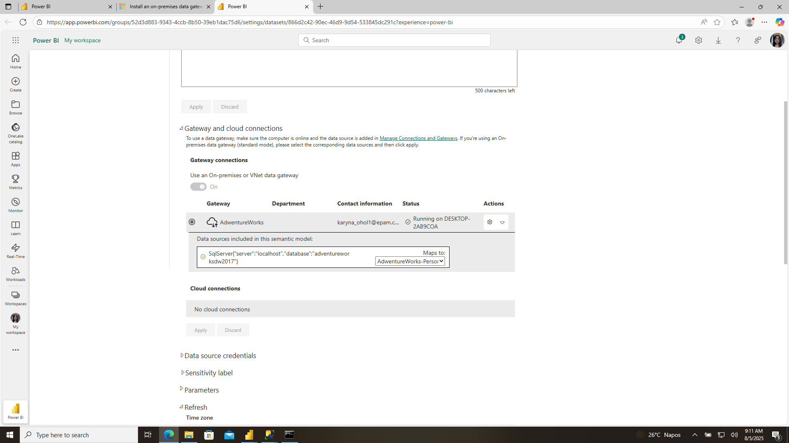

## AdventureWorks Power BI Dashboard Lab Report

This report documents the development of a comprehensive Power BI sales dashboard using the AdventureWorks sample database. 

The dashboard provides interactive visualizations for sales performance analysis, territory comparison, and product category insights with mobile optimization and automated data refresh capabilities.

---

### Key Performance Indicators
- Total Sales Amount: $29.36M
- Sales by Product Categories (Bikes, Accessories, Clothing)
- Regional sales performance across multiple territories
- Time-based sales trends and seasonality analysis

---

### Database Tables Used
- **FactInternetSales**: Primary fact table containing sales transactions
- **DimProduct**: Product master data with categories and subcategories
- **DimProductCategory**: Product category hierarchy
- **DimSalesTerritory**: Sales territory and regional information
- **DimCustomer**: Customer demographic information
- **DimDate**: Time dimension for temporal analysis

---

### Standard Visualizations 

**Color Palette Strategy**
- Blue (#1f77b4): Primary brand color for main metrics
- Orange (#ff7f0e): Secondary highlighting and accent color
- Green (#2ca02c): Success indicators and positive trends

#### Clustered Column Chart - Sales by Product Category
**Purpose**: Compare sales performance across product categories
**Justification**: Column charts provide clear visual comparison of categorical data, making it easy to identify the top-performing product categories
**Key Insights**: Bikes category significantly outperforms Accessories and Clothing

#### Line Chart - Sales Trend Over Time
**Purpose**: Display temporal sales patterns and identify seasonality
**Justification**: Line charts are optimal for showing trends over continuous time periods
**Key Insights**: Reveals seasonal patterns and growth trends in sales data

#### Pie Chart - Sales Distribution by Territory
**Purpose**: Show proportional sales distribution across different sales territories
**Justification**: Pie charts effectively communicate part-to-whole relationships for territorial analysis
**Key Insights**: Identifies dominant sales regions and market concentration

#### Table Visual - Top Products Performance
**Purpose**: Provide detailed product-level performance metrics
**Justification**: Tables offer precise numerical data for detailed analysis and reporting
**Key Insights**: Enables identification of best-selling products with exact figures

####  Card Visual - Total Sales KPI
**Purpose**: Prominently display key performance indicator
**Justification**: Card visuals provide immediate focus on critical business metrics
**Key Insights**: $29.36M total sales serves as primary success metric

####  Map Visual - Geographic Sales Distribution
**Purpose**: Visualize sales performance across geographical locations
**Justification**: Maps provide intuitive geographic context for territorial sales analysis
**Key Insights**: Identifies geographic sales concentration and market penetration

###  Custom Visualizations 

####  Word Cloud Visual
**Purpose**: Display product popularity through visual text sizing
**Justification Selected**: Word clouds provide an engaging, intuitive way to show relative importance of products based on sales volume. The visual impact immediately draws attention to top-performing products while maintaining aesthetic appeal.
**Implementation**: Product names sized proportionally to sales amounts
**Business Value**: Quickly identifies trending products and inventory focus areas

####  Tornado Chart
**Purpose**: Compare multiple metrics across categories simultaneously
**Justification Selected**: Tornado charts excel at showing bidirectional comparisons and variance analysis. They're particularly effective for comparing positive/negative variances or multiple KPIs side-by-side, providing more comprehensive analysis than standard bar charts.
**Implementation**: Product categories with multiple performance metrics
**Business Value**: Enables comprehensive performance comparison across multiple dimensions

---

##  Interactive Elements

### Slicer Configuration

#### Product Category Slicer (Dropdown)
- **Type**: Dropdown slicer
- **Field**: DimProductCategory.EnglishProductCategoryName
- **Purpose**: Space-efficient filtering for product categories
- **User Experience**: Clean interface with minimal space usage

####  Sales Territory Slicer (List Box)
- **Type**: List box slicer
- **Field**: DimSalesTerritory.SalesTerritoryRegion
- **Purpose**: Multi-select capability for territorial analysis
- **User Experience**: Allows multiple territory selection for comparison

#### Date Range Slicer
- **Type**: Date range slicer
- **Field**: FactInternetSales.OrderDate
- **Purpose**: Temporal filtering for trend analysis
- **User Experience**: Intuitive date selection with slider interface

###  Visual Interactions Configuration

####  Disabled Interaction: Date Slicer → Map Visual
**Implementation**: Date Range slicer interaction disabled with Map visual
**Rationale**: Geographic sales distribution remains static to provide consistent territorial reference regardless of time period selection
**Business Justification**: Maintains geographic context while allowing temporal analysis of other metrics

---

##  Mobile Layout Configuration

### 6.1 Mobile Design Principles
- **Vertical Stacking**: Visuals arranged in single-column layout
- **Priority Placement**: KPIs and critical charts positioned at top
- **Touch Optimization**: Larger interactive elements for touch interfaces
- **Simplified Navigation**: Streamlined slicer presentation

---

##  Data Refresh and Gateway Configuration

###  Personal Gateway Setup
- **Gateway Type**: On-premises data gateway (personal mode)
- **Connection**: SQL Server database connection
- **Authentication**: Windows Authentication with local credentials
- **Status**: Successfully configured and tested

### Scheduled Refresh Configuration
- **Frequency**: Daily refresh
- **Email Notifications**: Enabled for failure alerts
- **Credential Storage**: Securely stored in Power BI Service
- **Monitoring**: Refresh history tracking enabled

---

##  Sharing and Collaboration

###  Report Sharing
- **Publication**: Successfully published to Power BI Service
- **Workspace**: My Workspace 
- **Access Control**: Shared with mentor via email invitation
- **Notification**: Email notification sent to mentor

###  Filtered URL Implementation

**Base URL**: https://app.powerbi.com/groups/me/reports/c18b6d9d-f048-4c31-9539-b73f860e528e/f069dd8a28f1cf288a87?experience=power-bi

**Filtered URL Example**: Applied Australia Territory https://app.powerbi.com/groups/me/reports/c18b6d9d-f048-4c31-9539-b73f860e528e/f069dd8a28f1cf288a87?experience=power-bi&filter=DimSalesTerritory%2FSalesTerritoryRegion%20eq%20%27Australia%27

**Use Case**: Direct links for stakeholders to access specific filtered views

**Implementation**: URL parameters automatically append when sharing with active filters

---

## 12. Conclusion

The AdventureWorks Sales Dashboard successfully meets all project requirements while providing valuable business insights through intuitive visualizations. 

---
